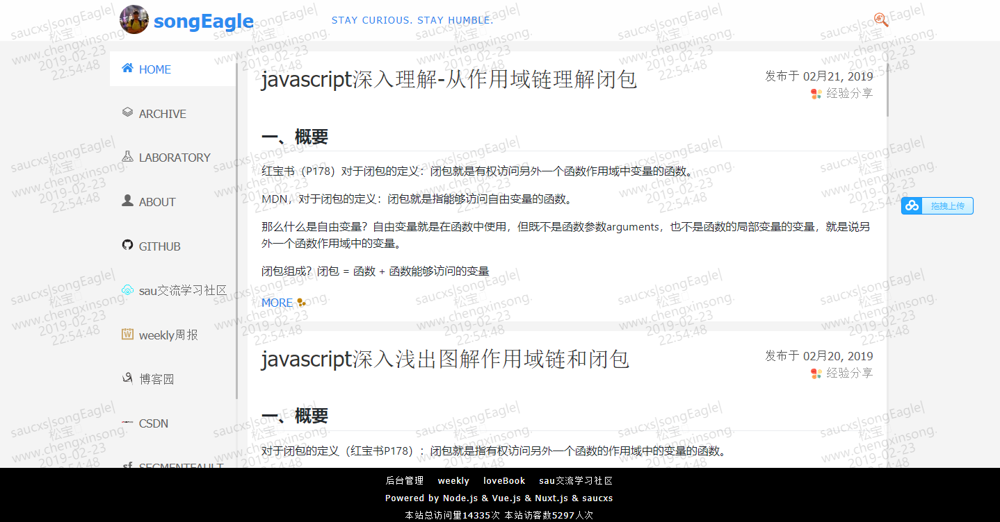

# [watermark-dom](https://github.com/saucxs/watermark-dom)
[](https://github.com/saucxs/watermark-dom)
[![GitHub license][license-image]][license-url]
[![GitHub version][version-image]][version-url]
[![GitHub stars][stars-image]][stars-url]
[![GitHub forks][forks-image]][forks-url]
[![GitHub issues][issues-image]][issues-image]
[![npm download][download-image]][download-url]


[license-image]: https://img.shields.io/github/license/saucxs/watermark-dom.svg
[license-url]: https://github.com/saucxs/watermark-dom/blob/master/LICENSE
[version-image]: https://img.shields.io/github/package-json/v/saucxs/watermark-dom.svg
[version-url]: https://github.com/saucxs/watermark-dom/blob/master/package-json
[stars-image]: https://img.shields.io/github/stars/saucxs/watermark-dom.svg
[stars-url]: https://github.com/saucxs/watermark-dom/stargazers
[forks-image]: https://img.shields.io/github/forks/saucxs/watermark-dom.svg
[forks-url]: https://github.com/saucxs/watermark-dom/network
[issues-image]: https://img.shields.io/github/issues/saucxs/watermark-dom.svg
[issues-url]: https://github.com/saucxs/watermark-dom/issues
[download-image]: https://img.shields.io/npm/dm/watermark-dom.svg
[download-url]: https://npmjs.org/package/watermark-dom

`watermark.js`是一个给B/S网站系统加水印的插件，确保系统保密性，安全性，降低数据泄密风险。简单易上手，支持多属性配置，支持本地和npm包引入，支持commonjs和es6引入。全局API有init()，load()，remove()方法。使用的是css3的pointer-events事件穿透属性和opacity透明属性，Shadow DOM(影子DOM)结构进行水印内容封装，随机插入到body下


水印插件内容，包含1、版本及功能，2、水印插件-使用，3、水印插件-testTool（测试工具），4、内置方法，5、支持各种属性配置使用，等等。

注意：基于本项目源码从事科研、论文、系统开发，"最好"在文中或系统中表明来自于本项目的内容和创意，否则所有贡献者可能会鄙视你和你的项目。 使用本项目源码请尊重程序员职业和劳动

## 1、版本及功能
+ 版本v 1.0.0
    - 1、支持文本水印；
    - 2、支持本地js，支持npm包；
    - 2、支持浏览器：Chrome，Firefox，Safari；
    - 3、支持api

+ 版本v 2.0.0
    - 1、支持AMD，CommonJs，ES6 module模块规范；
    - 2、支持浏览器：Chrome，Firefox，Safari，IE9及以上；
    - 3、未发布到最新npm包  

+ 版本v 2.0.1  更新时间：2019.06.12
    - 1、支持移除水印方法remove()
    - 2、废弃生成水印的createShadowRoot方法，而使用attachShadow方法。（使用上没有影响，因为最初设计时候做了兼容处理）
    - 3、未发布到最新npm包  

+ 版本v 2.0.2  更新时间：2019.06.17
    - 作为更新npm包，出现的问题，请不要用这个版本的包
    - 发布到最新npm包，有问题，误用  
 
+ 版本v 2.0.3  更新时间：2019.06.18
     - 发布最新npm包`npm i watermark-dom @2.0.3`，支持方法：`init(), load(), remove()`,放心使用

+ 版本v 2.1.3  更新时间：2019.08.16
     - 新增支持滚屏，谢谢[ishwy](https://github.com/saucxs/watermark-dom/issues/27)提出。
     - 解决缩放存在水印消失的问题，谢谢[wangmeng1991](https://github.com/saucxs/watermark-dom/issues/22)指出。
     - 解决loadMark多次调用时defaultSettings变量的复用问题，谢谢[shellphon](https://github.com/saucxs/watermark-dom/issues/23)指出。

## 2、水印插件-使用

### 2.1 本地引入封装的js文件

只是简单的加一个很浅的水印，实现起来很容易。不需要引入jquery插件。

`watermark.js`是必须要引进的组件

第一步：获取组件方式：`git clone https://github.com/saucxs/watermark-dom.git`

第二步：clone后，在需要加水印的相关页面引入水印文件"watermark.js":
```
script type="text/javascript" src="./watermark.js"></script>
```

第三步：在确保页面DOM加载完毕之后，调用watermark的load方法(手动加载):
```
   <script>watermark.load({ watermark_txt: "测试水印，1021002301，测试水印，100101010111101" })</script>
```
注意：我们提供了init方法，用来初始化水印，添加load和resize事件
```
   <script>watermark.init({ watermark_txt: "测试水印，1021002301，测试水印，100101010111101" })</script>
```

使用插件的效果地址1：http://www.chengxinsong.cn

Sample One：https://www.mwcxs.top/static/testTool/examples/examples-simple/index.html

Sample Two：https://www.mwcxs.top/static/testTool/examples/examples-setInterval/demo.html




### 2.2 npm包引入

第一步：npm获取水印组件包： 
````
npm install watermark-dom
````
第二步：引入水印模块：
````
import watermark from 'watermark-dom'
或者
var watermarkDom = require("watermark-dom")
````
第三步：在确保页面DOM加载完毕之后，调用watermark的load方法(手动加载):
```
   <script>watermark.load({ watermark_txt: "测试水印，1021002301，测试水印，100101010111101" })</script>
```
注意：我们提供了init方法，用来初始化水印，添加load和resize事件
```
   <script>watermark.init({ watermark_txt: "测试水印，1021002301，测试水印，100101010111101" })</script>
```

## 3、水印插件-testTool（测试工具）

查看地址：https://www.mwcxs.top/static/testTool/index.html

看到水印插件-测试demo的效果


## 4、内置方法

### 4.1 watermark.init(setting);
初始化水印，添加load和resize事件

例子
```js
watermark.init({ watermark_txt: "测试水印，1021002301，测试水印，100101010111101" });
``` 

### 4.2 watermark.load(setting); 
手动加载水印

例子
```js
watermark.load({ watermark_txt: "测试水印，1021002301，测试水印，100101010111101" });
``` 

### 4.3 watermark.remove(); 
手动移除水印

例子
```js
watermark.remove();
``` 


## 5、支持各种属性配置使用
```
watermark_id: 'wm_div_id',          //水印总体的id
watermark_prefix: 'mask_div_id',    //小水印的id前缀
watermark_txt:"测试水印",             //水印的内容
watermark_x:20,                     //水印起始位置x轴坐标
watermark_y:20,                     //水印起始位置Y轴坐标
watermark_rows:0,                   //水印行数
watermark_cols:0,                   //水印列数
watermark_x_space:100,              //水印x轴间隔
watermark_y_space:50,               //水印y轴间隔
watermark_font:'微软雅黑',           //水印字体
watermark_color:'black',            //水印字体颜色
watermark_fontsize:'18px',          //水印字体大小
watermark_alpha:0.15,               //水印透明度，要求设置在大于等于0.005
watermark_width:100,                //水印宽度
watermark_height:100,               //水印长度
watermark_angle:15,                 //水印倾斜度数
watermark_parent_width:0,      //水印的总体宽度（默认值：body的scrollWidth和clientWidth的较大值）
watermark_parent_height:0,     //水印的总体高度（默认值：body的scrollHeight和clientHeight的较大值）
watermark_parent_node:null     //水印插件挂载的父元素element,不输入则默认挂在body上
```
上面的属性都支持配置的，怎么使用呢？

基本山需要自己配置的属性：`watermark_txt`,`watermark_color`,`watermark_fontsize`,`watermark_alpha`,`watermark_angle`，`watermark_width`,`watermark_height`这7个属性一般是经常用到的，其他属性一般用的偏少。需要用到的就设置一下，不需要用到的就可以不设置，插件内部会有默认值的。

比如load方法的属性配置

```
 watermark.load({ 
    watermark_txt:"测试水印，saucxs，测试水印，songEagle，工号等",  //水印的内容
    watermark_color:'#5579ee',            //水印字体颜色
    watermark_fontsize:'24px',          //水印字体大小
    watermark_alpha:0.5,               //水印透明度，要求设置在大于等于0.005
    watermark_angle:135,                 //水印倾斜度数
    watermark_width:200,                //水印宽度
    watermark_height:200,               //水印长度
});
```
 
 所以一般先在[watermark-dom的测试工具](http://www.mwcxs.top/static/testTool/index.html)上，把需要配置的属性值，调试好之后在写入代码中，这样效率更高。


## 6、API介绍
    
 格式：[请求类型:]URL地址
 
 例如：
 
     get:/api/watermark    //获取水印参数
     post:/api/watermark   //发布水印参数
     put:/api/watermark    //更新水印参数
     delete:/api/watermark   //删除水印参数
     
 PS：如果没有添加请求类型的话，默认为get请求。
 
 返回结果定义：
 
 返回结果根据不同的状态需要定义，返回结果`<<<`标识，例如：
 
    <<<
    success
    {
        "errNum":0,
        "retMsg":"success",
        "retData":{
              "watermark_txt":"测试水印",
              "watermark_x":20,//水印起始位置x轴坐标
              "watermark_y":20,//水印起始位置Y轴坐标
              "watermark_rows":0,//水印行数
              "watermark_cols":0,//水印列数
              "watermark_x_space":100,//水印x轴间隔
              "watermark_y_space":50,//水印y轴间隔
              "watermark_font":'微软雅黑',//水印字体
              "watermark_color":'black',//水印字体颜色
              "watermark_fontsize":'18px',//水印字体大小
              "watermark_alpha":0.15,//水印透明度，要求设置在大于等于0.003
              "watermark_width":150,//水印宽度
              "watermark_height":100,//水印长度
              "watermark_angle":15,//水印倾斜度数
        }
    }
    <<<
    error
    {
        "errNum":0,
        "retMsg":"success",
        "retData":[]
    }

## 7、支持浏览器

Chrome,FireFox,Safari,IE9及以上浏览器

## 8、其他

欢迎使用[watermark-dom](https://github.com/saucxs/watermark-dom)插件，功能：给B/S网站系统加一个很浅的dom水印插件。

欢迎使用[captcha-mini](https://github.com/saucxs/captcha)插件，功能：生成验证码的插件，使用js和canvas生成的

欢迎使用[watermark-image](https://github.com/saucxs/watermark-image)插件，目前功能：图片打马赛克

一些使用文章介绍：

【1】https://juejin.im/post/5cb686f451882532c1535199

【2】http://www.chengxinsong.cn/post/34
